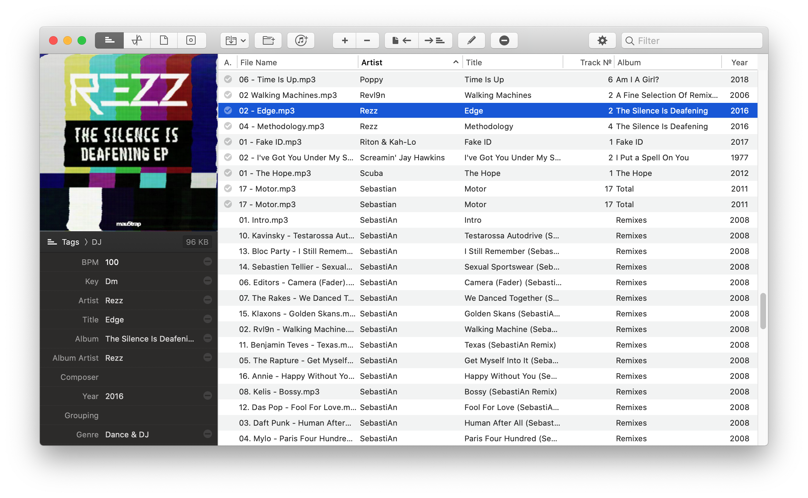
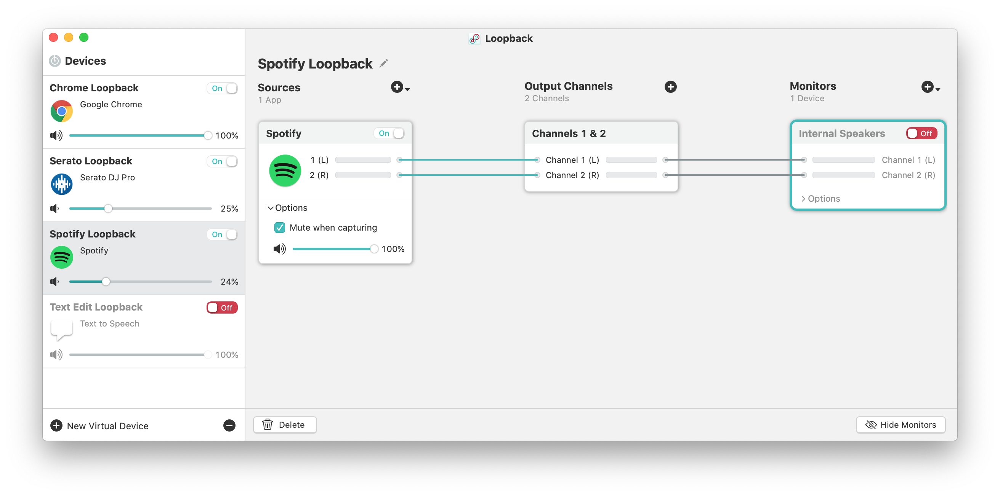
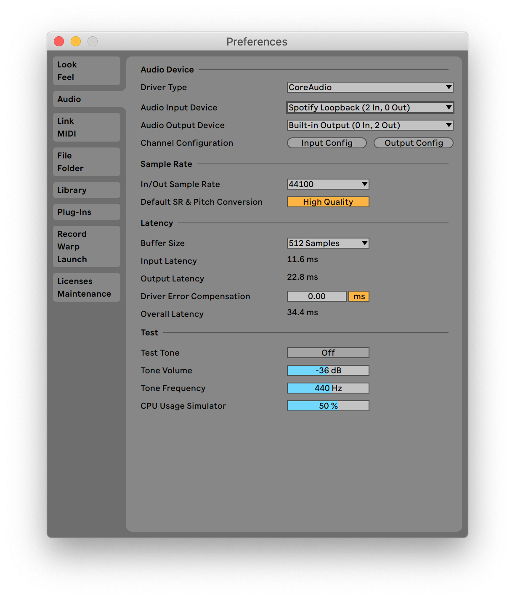
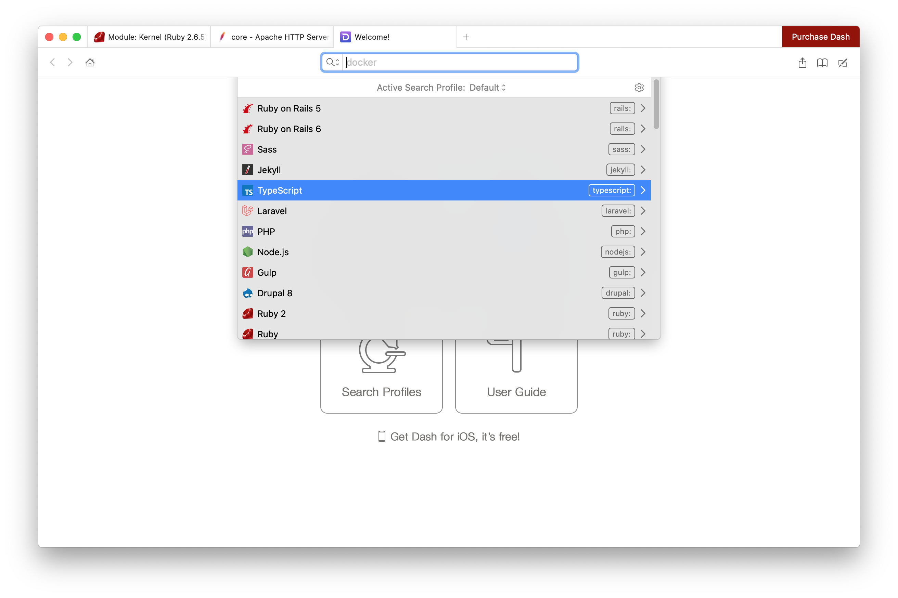
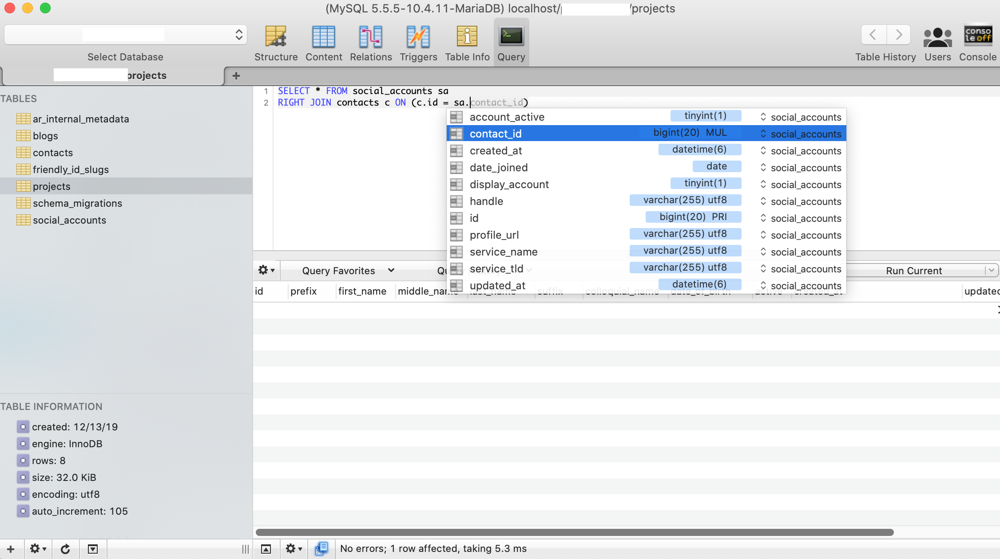
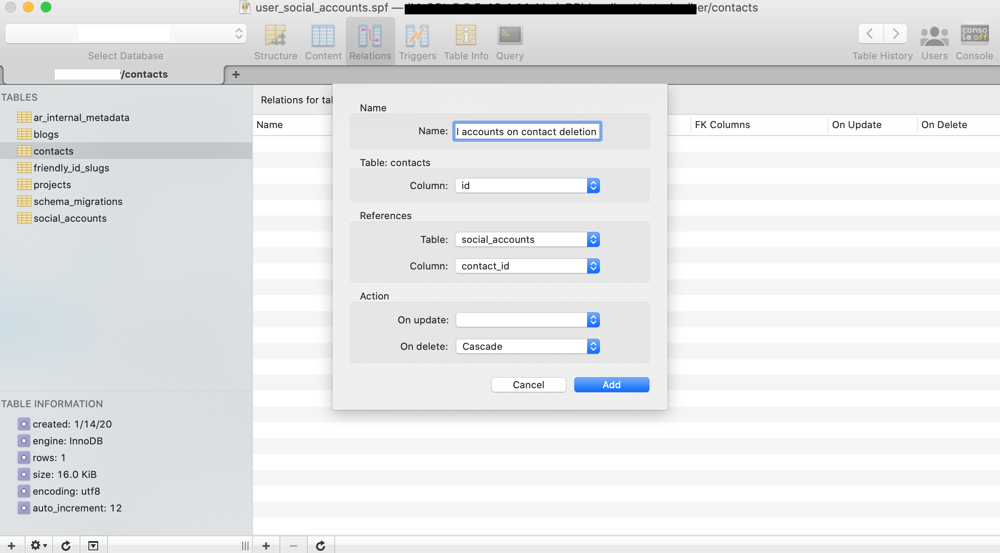
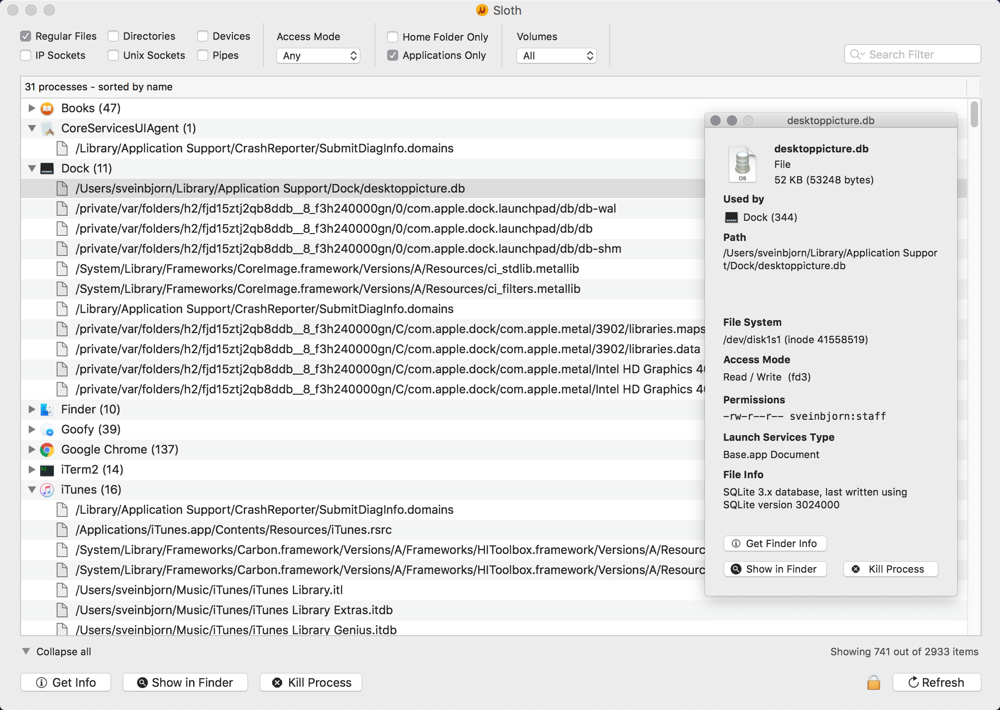

# Mac Software I Have Known And Loved.

## Table of Contents

<!-- TOC -->
[1. Music](#1-music)
  1. [Meta](#meta)
  2. [Loopback](#loopback)

[2. Development](#2-development)
  1. [Dash](#dash)
  2. [Sloth](#sloth)

[3. Security](#3-security)
  1. [1Password](#1password)

[4. Productivity](#4-productivity)
<!-- /TOC -->

----

## 1. Music

### Meta

The problem with iTunes is that it's very opinionated and tries to move your
files around. You also can't feed it multiple sources, and the final nail in the
coffin was that I didn't see a spot to save the "Key" of the song, which is
killer for me since I want a long-lasting library I can use for music
production/DJing.

Cost (at time of writing):

- Trial mode
- \$20 per license
  [https://www.nightbirdsevolve.com/meta/](https://www.nightbirdsevolve.com/meta/)

### Loopback

"Cable-free audio routing for your Mac"\n
What's great about Loopback is you can turn any sound emitting program into an
audio interface that a DAW can pick up. Just set up an audio interface for
Loopback, like so:

then set the input device in your DAW to be that Loopback.

Some ideas:

- Find a piece of audio on YouTube you want to sample?
- Want to pipe Spotify directly into your DAW?
- Want to route your DJ controller audio into Ableton to post process a DJ set?
- Want to easily capture a sample of TextEdit's "text-to-speech" voice?

Cost (at time of writing):

- Permissive trial mode (Seriously, it feels like old-school WinRAR nagware)
- \$99 per license
  [https://rogueamoeba.com/loopback/](https://rogueamoeba.com/loopback/)

## 2. Development

### Dash

Allows you to download documentation and man pages for use offline. Great for
when you're traveling, or generally wanting to search multiple docs easily
without a web browser

Cost (at time of writing):

- Permissive trial mode (Nagware)
- \$29.99 per license
  [https://kapeli.com/dash](https://kapeli.com/dash)

### Sequel Pro

Sequel Pro is the first viable replacement to MySQL Workbench, which is just not
fun to use on Mac anymore.

#### Quality-of-life features like Intellisense:

#### Addimg a "cascade delete":

Cost (at time of writing):
- **Free**, but you can donate to the project here:
-  - [Donate](https://sequelpro.com/donate)
- [https://sequelpro.com](https://sequelpro.com)
- [https://github.com/sequelpro/sequelpro](https://github.com/sequelpro/sequelpro)

### Sloth

Sloth is a Mac application that displays all open files and sockets in use by
all running processes on your system. This makes it easy to inspect which apps
are using which files and sockets.

_Image source: [https://sveinbjorn.org/images/sloth_screenshot1.jpg](https://sveinbjorn.org/images/sloth_screenshot1.jpg)_

Cost (at time of writing):
- **Free**
  > Sloth is free, open-source software. If you find this program useful, please make a [donation](https://sveinbjorn.org/donations) to support continued development.
  > https://sveinbjorn.org/sloth

## 3. Security

### 1Password

So handy for storing secure passwords/documents/notes/files.

Cost (at time of writing):

- SaaS. $2.99/mo per user, or $4.99/mo. for a family account.
  _Note: If your employer has a business account, you get a free family license as well._
- [https://1password.com/](https://1password.com/)

## 4. Productivity
